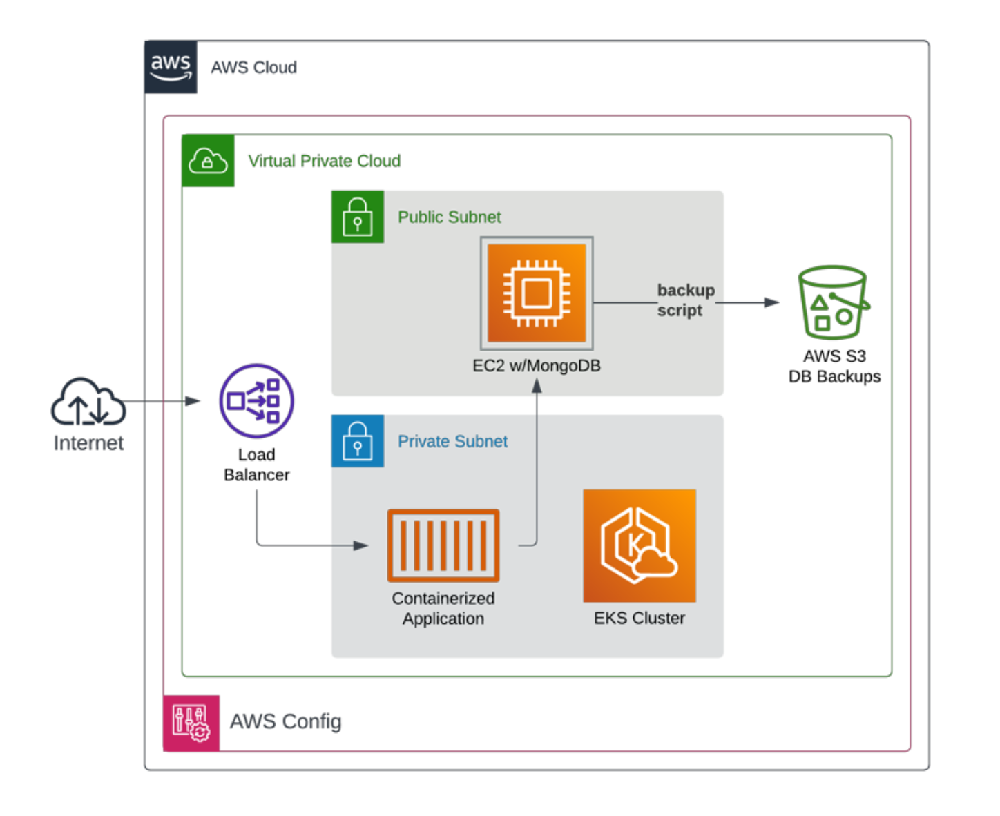

# Extremely Secure™ Three Tier App



## Summary

This codebase deploys an example of an extremely secure three-tier web app.
There are no misconfigurations or vulnerabilities in this codebase.

Absolutely none.

Don't poke around trying to find any either.

## Running It Locally

[Go here](https://github.com/carlosonunez/tasky) to run our example web app
locally.

This will start the application and its database.

## Deploying Into AWS

> 💸 **MONEY WARNING**: This will cost you ~USD $0.33/hr if run during business
> hours, or ~USD $0.11/hr if you disable AWS Config.

1. `export` the following values into your environment:

- `TERRAFORM_STATE_S3_BUCKET`: The name of the bucket to store Terraform state
  into.
- `TERRAFORM_STATE_S3_KEY`: The name of the key within the bucket above to store
  state into.

2. Log into AWS and ensure the following environment variables are exported:

- `AWS_ACCESS_KEY_ID`
- `AWS_SECRET_ACCESS_KEY`
- `AWS_SESSION_TOKEN` (if using AWS STS)

3. Deploy the app:

```sh
make deploy
```

This will use Terraform to create the following resources
within AWS:

- VPC
- EC2 Spot Instance
- EKS Cluster with a single EC2 Spot Worker

This will also use Ansible to:

- Install and configure the database,
- Deploy the application and its related resources into EKS

Finally, it will use [BATS](https://bats-core.readthedocs.io) to test that
requirements have been met.

## Troubleshooting

### Logging into the database

You can log into the database to troubleshoot app connection issues by running:

```sh
docker-compose run --rm ssh-into-db
```
